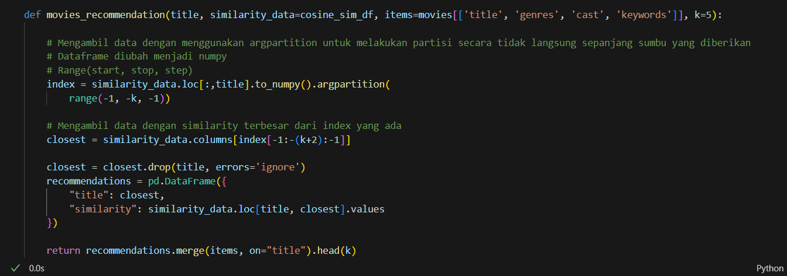
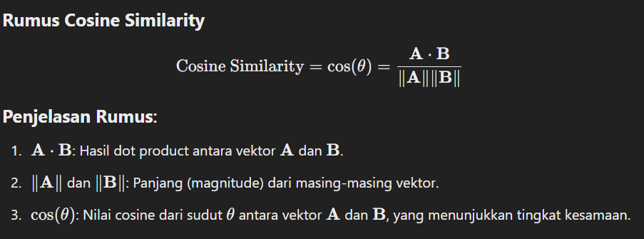

# Laporan Proyek Machine Learning - Zahid Faqih Alim Rabbani

## Project Overview

Industri hiburan, khususnya film, telah berkembang pesat dalam beberapa dekade terakhir dengan ribuan judul film dirilis setiap tahunnya. Dengan begitu banyaknya pilihan yang tersedia, pengguna seringkali merasa kewalahan dalam menemukan film yang sesuai dengan minat dan preferensi mereka. Oleh karena itu, sistem rekomendasi film menjadi solusi penting untuk membantu pengguna menjelajahi dunia hiburan dengan lebih mudah.

Sistem rekomendasi adalah alat penting untuk meningkatkan pengalaman pengguna dan retensi pelanggan, menurut laporan oleh McKinsey (2013), sistem rekomendasi yang efektif dapat meningkatkan keterlibatan pengguna hingga 20-30% pada platform berbasis konten digital. Penelitian dari Konstan & Riedl (2012) menunjukkan bahwa sistem rekomendasi membantu pengguna mengurangi waktu pencarian dan meningkatkan kepuasan dengan konten yang dikonsumsi.

Proyek sistem rekomendasi ini penting karena menyelesaikan beberapa tantangan utama yang dihadapi oleh pengguna dan platform dalam industri hiburan, terutama yang berkaitan dengan peningkatan pengalaman pengguna, efisiensi waktu, dan pengoptimalan bisnis. 

Sumber Referensi : 
The Netflix Recommender System: Algorithms, Business Value, and Innovation
Gomez-Uribe, C. A., & Hunt, N. (2015). ACM Transactions on Management Information Systems (TMIS).
Big Data, Analytics, and the Future of Marketing & Sales. McKinsey & Company (2013).

## Business Understanding

### Problem Statements
- Bagaimana cara membantu pengguna menemukan film yang relevan sesuai preferensi mereka di tengah banyaknya pilihan yang tersedia?
- Bagaimana algoritma yang optimal untuk membantu pengguna menemukan film yang relevan sesuai preferensi mereka?
### Goals

- Membuat sistem rekomendasi dari dataset banyak film yang ada untuk menyarankan film yang relevan sesuai preferensi mereka
- Mengidentifikasi algoritma machine learning yang paling optimal untuk menyarankan film yang relevan melalui perbandingan 2 algoritma yang berbeda pada sistem rekomendasi

### Solution statements
- menggunakan content-based filtering pada system recommendation dengan 2 algoritma yang berbeda, yaitu tf-idf dan word embeddings, serta membandingkan keduanya untuk menentukan mana algoritma yang paling optimal

## Data Understanding
Datasets yang saya gunakan diambil dari kaggle. Berikut link sumber datasetnya :
https://www.kaggle.com/datasets/tmdb/tmdb-movie-metadata

### Kondisi Data

Dari sumber didapatkan 2 dataset yaitu tmdb_5000_credits.csv yang berisi daftar cast beserta kru dalam film dan tmdb_5000_movies.csv yang berisi berbagai macam informasi pada film

pada tmdb_5000_credits.csv terdapat 4 variabel dan 4803 entri pada masing-masing variabel.

sedangkan pada tmdb_5000_movie.csv terdapat 24 variabel yang rata rata 4800 entri pada masing-masing variabel

untuk memudahkan saya gabung kedua dataset dengan fungsi merge.

Pada gambar diatas, setelah kedua dataset digabung diketahui bahwa jumlah data sebanyak 4809 baris dan 23 kolom, missing value yang banyak dibagian homepage dan tagline, dan tidak ada data duplikat.

### Exploratory Data Analysis
**Berikut adalah penjelasan masing-masing variabel data**
- movie_id: ID unik untuk setiap film (terhubung dengan dataset kedua).
- title: Judul film.
- cast: Daftar aktor yang berperan dalam film, disimpan dalam format JSON (termasuk nama karakter dan informasi lainnya).
- crew: Daftar kru film, termasuk sutradara, produser, dll., disimpan dalam format JSON.
- budget: Anggaran produksi film (dalam USD).
- genres: Genre film dalam format JSON (misalnya, Action, Adventure).
- homepage: URL situs resmi film (jika tersedia).
id: ID unik film (identik dengan movie_id dari dataset pertama).
- keywords: Kata kunci yang menggambarkan tema film dalam format JSON.
- original_language: Bahasa asli film (contoh: "en" untuk bahasa Inggris).
- original_title: Judul asli film (terkadang berbeda jika diterjemahkan).
- overview: Sinopsis singkat film.
- popularity: Skor popularitas film berdasarkan TMDb.
- production_companies: Perusahaan produksi film dalam format JSON.
- production_countries: Negara tempat film diproduksi dalam format JSON.
- release_date: Tanggal rilis film.
- revenue: Pendapatan box office film (dalam USD).
- runtime: Durasi film (dalam menit).
- spoken_languages: Bahasa yang digunakan dalam film dalam format JSON.
- status: Status rilis film (contoh: "Released" atau "Post Production").
- tagline: Slogan atau tagline film.
- title: Judul film.
- vote_average: Rata-rata skor ulasan film (skala 0-10).
- vote_count: Jumlah ulasan film.

pada proyek ini, saya akan mengeksplorasi beberapa variabel saja, antara lain: vote_average, vote_count, genres, keywords, dan cast. 

**Vote Average dan vote count analysis**

pada vote average Banyak film cenderung mendapatkan penilaian rata-rata di kisaran 5-7, Film dengan skor lebih tinggi (>7) mungkin merupakan film populer atau berkualitas tinggi, film dengan skor rendah (<5) kemungkinan besar dianggap kurang baik oleh penonton
Mayoritas film memiliki skor mendekati rata-rata (~6.0), menunjukkan penilaian cenderung moderat.

Sedangkan pada vote count hanya sedikit film yang menerima jumlah suara sangat tinggi, film yang jumlah suaranya rendah kemungkinan kurang populer

Jadi Menggunakan metrik berbobot seperti Weighted Rating menjadi penting karena film dengan jumlah suara tinggi cenderung lebih andal dalam mencerminkan kualitas. Serta film dengan skor lebih tinggi bisa menjadi prioritas untuk direkomendasikan.

**genres, keywords, dan cast**

genres, keywords, dan cast digunakan untuk content-based filtering. ketiga variabel ini ditulis dalam format json yang berisikan id dan nama masing-masing variabel. Namun yang kita butuhkan hanya nama saja.

untuk mendapatkan nama dari masing masing variabel dengan cara mengubah setiap string JSON menjadi Python object (list of dictionaries) dan ambil nilai name dari masing-masing dictionary dengan library ast. Lalu setiap nama yang didapat dikembalikan ke kolom dataframe masing masing

Didapat bahwa pada dataset terdapat 20 genre yang berbeda, 9806 keywords yang berbeda, dan 54186 cast yang berbeda. Dari sini kemungkinan content-based analysis akan lebih ke berdasarkan genre dan keywords.

## Data Preparation
Pertama-tama karena terdapat 2 dataset yaitu credits.csv dan movies.csv, untuk memudahkan saya gabung kedua dataset dengan fungsi merge.

Untuk mengetahui rating, kita bisa saja menggunakan vote_average dari dataset, namun menggunakan itu saja tidak akan adil karena film dengan rata-rata rating 8,9 dengan 3 votes tidak bisa dibandingkan dengan film dengan rata rata 7.5 dengan 50 votes. Jadi, saya akan menggunakan IMDB weighted rating dengan rumus : 

Kita punya v dan r, untuk mencari c bisa dengan fungsi mean(), untuk m, suara minimum yang diperlukan untuk dicantumkan dalam bagan. Kami akan menggunakan persentil ke-90 sebagai batas. Dengan kata lain, agar sebuah film dapat tampil di nominasi, film tersebut harus memiliki lebih banyak suara daripada setidaknya 90% film dalam daftar.

Selanjutnya fungsi weighted dibuat sesuai dengan rumus WR, dan diaplikasikan ke dataframe menjadi variabel baru yang bernama weighted_rating.

Langkah selanjutnya adalah memilah variabel yang akan dipilih. Untuk content-based filtering saya memilih variabel id, title, keywords, genres, cast, overview, dan weighted rating.

genres, keywords, dan cast digunakan untuk content-based filtering. ketiga variabel ini ditulis dalam format json yang berisikan id dan nama masing-masing variabel. Namun yang kita butuhkan hanya nama saja.

untuk mendapatkan nama dari masing masing variabel dengan cara mengubah setiap string JSON menjadi Python object (list of dictionaries) dan ambil nilai name dari masing-masing dictionary dengan library ast. Lalu setiap nama yang didapat dikembalikan ke kolom dataframe masing masing dan dipisahkan dengan koma melalui fungsi join().

Dan semua variabel yang berformat json sudah diubah menjadi nama saja.

dikarenakan pada fungsi extract_names, jika terjadi error saat memproses string JSON (misalnya, format JSON tidak valid), fungsi ini akan mengembalikan string kosong (""), maka kita rubah nilai string kosong menjadi nan agar terdeteksi bahwa string tersebut merupakan missing value dengan fungsi replace().

Setelah dicek terdapat missing value, oleh karena itu kita hapus dengan fungsi dropna()

pada variabel cast menghilangkan semua spasi di antaranya. Hal ini dilakukan agar vektorizer kita tidak menghitung Michael pada "Michael Jackson" dan "Michael Caine" sebagai hal yang sama.

Kemudian variabel genres, keywords, cast, overview, dan weighted_rating
digabungkan menjadi satu variabel features untuk membuat representasi gabungan dari karakteristik film. Representasi gabungan ini kemudian digunakan untuk menghitung kesamaan antar film menggunakan metode cosine similarity.

Setelah itu Fungsi lower() diaplikasikan pada variabel features dengan tujuan untuk menyeragamkan huruf menjadi huruf kecil agar model tidak membedakan antara kata yang sama tapi memiliki perbedaan huruf kapital, serta meningkatkan akurasi.

lalu koma diganti menjadi spasi pada kolom 'cast', 'genres', 'keywords', dan ketika membuat kolom 'features'. Tujuannya adalah untuk menghindari kesalahan interpretasi data saat proses pembentukan vektor fitur menggunakan TF-IDF.

Dengan mengganti koma menjadi spasi, kita memastikan bahwa semua item dari kolom-kolom tersebut dianggap sebagai token terpisah.

## Modeling
Untuk model saya menggunakan 2 algoritma, yaitu tf-idf dan word embeddings(word2vec).

**TF-IDF**

TF-IDF Mengonversi teks menjadi representasi vektor yang mencerminkan pentingnya kata dalam dokumen tertentu dibandingkan dengan kumpulan dokumen.

Kelebihannya adalah cocok untuk data yang berbasis teks seperti deskripsi dan metadata, serta mudah diimplementasikan.

Kekurangannya adalah Tidak mempertimbangkan hubungan kompleks antarfitur.

Setelah data siap lakukan fit dan transform ke bentuk matrix

Perhatikanlah, matriks yang kita miliki berukuran (4384, 79116). Nilai 4384 merupakan ukuran data dan 79116 merupakan matrik features dari semua film. 

Selanjutnya kita akan menghitung derajat kesamaan (similarity degree) antar restoran dengan teknik cosine similarity. Di sini, kita menggunakan fungsi cosine_similarity dari library sklearn. 

film dengan derajat kesamaan yang semakin mendekati angka 1 maka semakin mirip antar film.

selanjutnya dataframe dibuat dari variabel cosine_similarity.

Lalu fungsi untuk membuat sistem rekomendasi dibuat dengan keluaran sistem berupa top-N recommendation.

dan yap sistem rekomendasi berhasil dibuat.

**Word Embeddings(Word2Vec)**
Word Embeddings menggunakan representasi vektor berbasis kata yang lebih kaya untuk memahami hubungan semantik antarfitur.
Embedding seperti Word2Vec atau GloVe dapat digunakan untuk genre, keywords, atau sinopsis film.

Namun disini yang saya gunakan adalah Word2Vec karena lebih populer dan mudah diimplementasikan.

Kelebihannya adalah mampu menangkap makna semantik dan hubungan kata yang kompleks. Dan lebih akurat daripada model berbasis vektor ruang sederhana.

kekurangannya Membutuhkan lebih banyak sumber daya komputasi dan implementasi lebih kompleks.

Pertama tama tokenisasi terlebih dahulu variabel features menjadi variabel baru yaitu tokens. Model word2vec dibuat, lalu apply ke variabel tokens, dan dibuat variabel baru bernama embedding.

Langkah selanjutnya sama seperti tf-idf, yaitu apply ke cosine similarity, buat dataframe, dan buat sistem rekomendasi.

## Evaluation
Metrik evaluasi yang saya gunakan adalah precision@k.

Precision@k adalah metrik evaluasi yang digunakan dalam sistem rekomendasi, khususnya untuk menilai kualitas rekomendasi teratas. Metrik ini mengukur seberapa akurat sistem dalam merekomendasikan item yang relevan dalam daftar rekomendasi yang terbatas pada k item teratas

Dapat dihitung dengan rumus : 

metrik ini bekerja dengan cara membagi sistem dengan jumlah item yang sebenarnya relevan dengan jumlah item yang direkomendasikan.

Untuk menentukan item yang relevan saya menggunakan sistem rekomendasi dari situs tmdb dengan judul Pirates of the Caribbean: At World's End.
https://www.themoviedb.org/movie/285-pirates-of-the-caribbean-at-world-s-end

dari precision yang didapat bahwa dari 10 film, pada algoritma tf-idf merekomendasikan 3 item yang sama dengan tmdb, sedangkan pada algoritma word2vec hanya merekomendasikan 1 item yang sama dengan tmdb.

Dari hasil evaluasi tersebut dapat disimpulkan bahwa algoritma tf-idf lebih baik daripada algoritma word2vec.

Maka untuk sistem rekomendasi berdasarkan content-based filtering digunakan algoritma tf-idf.s

Dan hasil rekomendasi kurang sesuai dengan tmdb mungkin dikarenakan kurangnya data yang digunakan dalam sistem rekomendasi.
**---Ini adalah bagian akhir laporan---**
